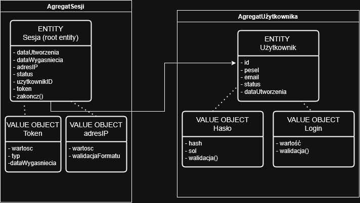
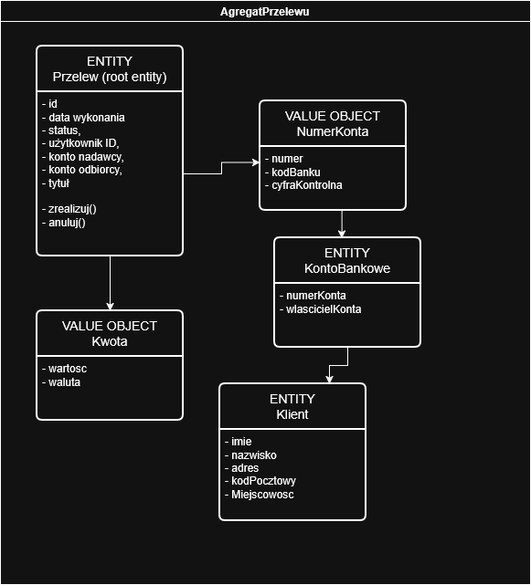

# Domain Driven Design - Model Aplikacji Bankowej

## Opis zadania

Celem zadania było zamodelowanie bezpiecznej aplikacji bankowej wykorzystując zasady Domain Driven Design. Skupiono się na fragmencie systemu związanym z uwierzytelnieniem użytkowników i wykonywaniem przelewów. Model obejmuje 3 główne encje w obrębie dwóch Bounded Context: Uwierzytelnienie oraz Przelewy. Wszystkie encje zostały zaprojektowane z uwzględnieniem zasad bezpieczeństwa, walidacji danych oraz niezmienności obiektów wartości.

## Model Domain Driven Design

### Bounded Context: Uwierzytelnienie

### Bounded Context: Przelewy

## Założenia i ograniczenia

### Bounded Context: Uwierzytelnienie

#### Agregat: AgregatSesji

**Root Entity: Sesja**

| Atrybut | Typ | Ograniczenia | Opis |
|---------|-----|--------------|------|
| dataUtworzenia | DateTime | Format: YYYY-MM-DD HH:MM:SS | Data i czas utworzenia sesji |
| dataWygasniecia | DateTime | Format: YYYY-MM-DD HH:MM:SS, min: dataUtworzenia + 30 min | Data i czas wygaśnięcia sesji |
| adresIP | adresIP (Value Object) | Wymagane | Adres IP użytkownika |
| status | Enum | Wartości: AKTYWNA, WYGASLA, WYLOGOWANA | Status sesji |
| uzytkownikID | UUID | Wymagane, referencja do AgregatuUżytkownika | Identyfikator użytkownika (referencja między agregatami) |
| token | Token (Value Object) | Wymagane, unikalny | Token sesji użytkownika |

**Zawarte w agregacie:**
- **Token** (Value Object) - token sesji z wartością, typem i datą wygaśnięcia
- **adresIP** (Value Object) - adres IP z walidacją formatu

**Referencje (poza agregatem):**
- **Użytkownik** (UUID) - referencja do AgregatuUżytkownika

**Operacje:**
- `zakoncz()` - Zakończenie sesji (zmiana statusu na WYLOGOWANA lub WYGASLA)

---

#### Agregat: AgregatUżytkownika

**Root Entity: Użytkownik**

| Atrybut | Typ | Ograniczenia | Opis |
|---------|-----|--------------|------|
| id | UUID | Unikalny, generowany automatycznie | Identyfikator użytkownika |
| pesel | String | Format: 11 cyfr, walidacja sumy kontrolnej, unikalny | PESEL użytkownika |
| email | String | Format: email, unikalny, Max: 100 znaków | Adres email użytkownika |
| status | Enum | Wartości: AKTYWNY, ZABLOKOWANY, NIEAKTYWNY | Status konta użytkownika |
| dataUtworzenia | DateTime | Format: YYYY-MM-DD HH:MM:SS | Data utworzenia konta |

**Zawarte w agregacie:**
- **Hasło** (Value Object) - hasło użytkownika (zahashowane) z metodą walidacji
- **Login** (Value Object) - login użytkownika z metodą walidacji

#### Value Object: Login (zawarte w AgregacieUżytkownika)

| Atrybut | Typ | Ograniczenia | Opis |
|---------|-----|--------------|------|
| wartosc | String | Min: 3 znaki, Max: 50 znaków, tylko litery, cyfry, podkreślenia | Login użytkownika (może być email lub nazwa użytkownika) |

**Operacje:**
- `walidacja()` - Sprawdzenie formatu i długości loginu

**Niezmienność:** Obiekt wartości jest niezmienny.

#### Value Object: Hasło (zawarte w AgregacieUżytkownika)

| Atrybut | Typ | Ograniczenia | Opis |
|---------|-----|--------------|------|
| hash | String | Format: bcrypt hash, Min: 60 znaków | Zahashowane hasło użytkownika |
| sol | String | Format: salt dla bcrypt | Sól użyta do hashowania |

**Operacje:**
- `walidacja()` - Walidacja hasła (sprawdzenie czy hash i sól są poprawne)

**Niezmienność:** Obiekt wartości jest niezmienny - hasło nie może być odczytane w formie plaintext.

#### Value Object: Token (zawarte w AgregacieSesji)

| Atrybut | Typ | Ograniczenia | Opis |
|---------|-----|--------------|------|
| wartosc | String | Format: JWT token, Min: 100 znaków | Wartość tokena sesji |
| typ | Enum | Wartości: SESJA, ODŚWIEŻENIE, RESET_HASLA | Typ tokena |
| dataWygasniecia | DateTime | Format: YYYY-MM-DD HH:MM:SS | Data wygaśnięcia tokena |

**Niezmienność:** Obiekt wartości jest niezmienny.

#### Value Object: adresIP (zawarte w AgregacieSesji)

| Atrybut | Typ | Ograniczenia | Opis |
|---------|-----|--------------|------|
| wartosc | String | Format: IPv4 lub IPv6 | Wartość adresu IP |

**Operacje:**
- `walidacjaFormatu()` - Sprawdzenie czy adres IP ma poprawny format (IPv4 lub IPv6)

**Niezmienność:** Obiekt wartości jest niezmienny.

---

### Bounded Context: Przelewy

#### Agregat: AgregatPrzelewu

**Root Entity: Przelew**

| Atrybut | Typ | Ograniczenia | Opis |
|---------|-----|--------------|------|
| id | UUID | Unikalny, generowany automatycznie | Identyfikator przelewu |
| data wykonania | DateTime | Format: YYYY-MM-DD HH:MM:SS | Data i czas wykonania przelewu |
| status | Enum | Wartości: OCZEKUJACY, WYKONANY, ANULOWANY | Status przelewu |
| użytkownik ID | UUID | Wymagane, referencja do AgregatuUżytkownika | Identyfikator użytkownika wykonującego przelew (referencja między agregatami) |
| konto nadawcy | NumerKonta (Value Object) | Wymagane, Format: XX-XXXX-XXXX-XXXX-XXXX-XXXX-XXXX (26 cyfr) | Konto źródłowe przelewu |
| konto odbiorcy | NumerKonta (Value Object) | Wymagane, Format: XX-XXXX-XXXX-XXXX-XXXX-XXXX-XXXX (26 cyfr), różne od nadawcy | Konto docelowe przelewu |
| tytuł | String | Wymagane, Max: 140 znaków | Tytuł przelewu |

**Zawarte w agregacie:**
- **Kwota** (Value Object) - kwota przelewu z walutą
- **NumerKonta** (Value Object) - używany dla konta nadawcy i odbiorcy

**Referencje (poza agregatem):**
- **Użytkownik** (UUID) - referencja do AgregatuUżytkownika
- **KontoBankowe** (Entity) - referencja przez NumerKonta
- **Klient** (Entity) - referencja przez KontoBankowe

**Operacje:**
- `zrealizuj()` - Realizacja przelewu (walidacja: użytkownik uwierzytelniony, status = OCZEKUJACY, konto nadawcy i odbiorcy różne, zmiana statusu na WYKONANY)
- `anuluj()` - Anulowanie przelewu (walidacja: użytkownik ma uprawnienia, tylko jeśli status = OCZEKUJACY lub WYKONANY, zmiana statusu na ANULOWANY)

#### Value Object: Kwota (zawarte w AgregaciePrzelewu)

| Atrybut | Typ | Ograniczenia | Opis |
|---------|-----|--------------|------|
| wartosc | Decimal | Min: 0.01, Max: 1000000.00, Precyzja: 2 miejsca po przecinku | Wartość kwoty |
| waluta | String | Wartości: "PLN", "EUR", "USD" | Waluta kwoty |

**Niezmienność:** Obiekt wartości jest niezmienny.

#### Value Object: NumerKonta (zawarte w AgregaciePrzelewu)

| Atrybut | Typ | Ograniczenia | Opis |
|---------|-----|--------------|------|
| numer | String | Format: XX-XXXX-XXXX-XXXX-XXXX-XXXX-XXXX (26 cyfr) | Numer konta zgodny z formatem IBAN |
| kodBanku | String | 4 cyfry | Kod banku (pierwsze 4 cyfry numeru konta) |
| cyfraKontrolna | String | 2 cyfry | Cyfra kontrolna (pierwsze 2 cyfry numeru konta) |

**Referencje (poza agregatem):**
- **KontoBankowe** (Entity) - referencja do konta bankowego powiązanego z numerem konta

**Niezmienność:** Obiekt wartości jest niezmienny.

---

#### Entity: KontoBankowe (referencja z NumerKonta)

| Atrybut | Typ | Ograniczenia | Opis |
|---------|-----|--------------|------|
| numerkonta | String | Format: XX-XXXX-XXXX-XXXX-XXXX-XXXX-XXXX (26 cyfr), unikalny | Numer konta bankowego |
| wlascicielId | UUID | Wymagane, referencja do Klienta | Identyfikator właściciela konta |

**Referencje:**
- **Klient** (Entity) - właściciel konta

---

#### Entity: Klient (referencja z KontoBankowe)

| Atrybut | Typ | Ograniczenia | Opis |
|---------|-----|--------------|------|
| id | UUID | Unikalny, generowany automatycznie | Identyfikator klienta |
| imie | String | Min: 2 znaki, Max: 50 znaków, tylko litery | Imię klienta |
| nazwisko | String | Min: 2 znaki, Max: 50 znaków, tylko litery | Nazwisko klienta |
| adres | String | Min: 3 znaki, Max: 100 znaków | Adres zamieszkania klienta |
| kodPocztowy | String | Format: XX-XXX (5 cyfr, myślnik, 3 cyfry) | Kod pocztowy zgodny z formatem polskim |
| Miejscowosc | String | Min: 2 znaki, Max: 50 znaków, tylko litery | Miejscowość zamieszkania klienta |

---

### Integracja między kontekstami

Kontekst **Przelewy** komunikuje się z kontekstem **Uwierzytelnienie** w celu weryfikacji tożsamości użytkownika przed wykonaniem operacji na przelewach. Przed utworzeniem, wykonaniem lub anulowaniem przelewu następuje weryfikacja tokena sesji oraz statusu użytkownika. W przypadku zablokowania konta użytkownika, wszystkie aktywne sesje są automatycznie wylogowywane.

### Zasady bezpieczeństwa

Wszystkie dane wejściowe są walidowane przed utworzeniem obiektów. Obiekty wartości są niezmienne, a operacje na agregatach wykonywane w transakcjach. Hasła przechowywane są w formie hash (bcrypt), a tokeny sesji mają ograniczony czas życia (30 minut). Sesje są automatycznie wylogowywane przy blokadzie konta użytkownika.
