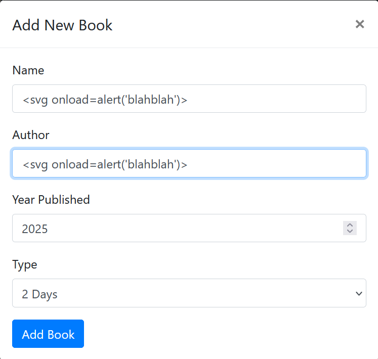
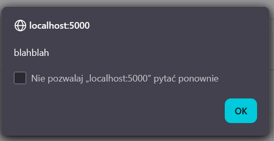
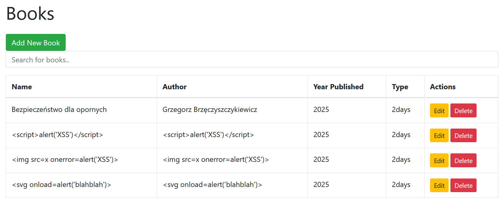
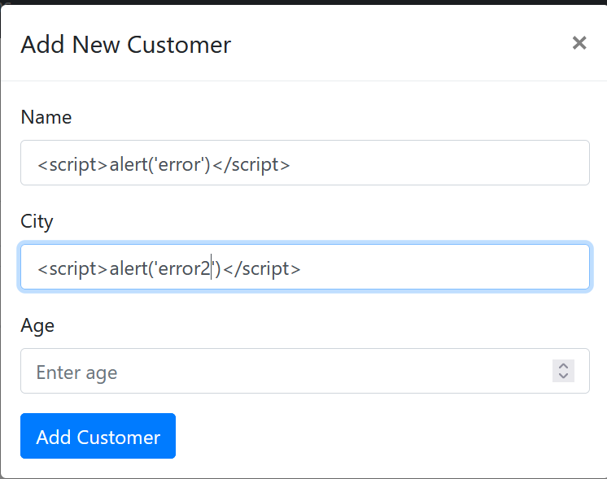
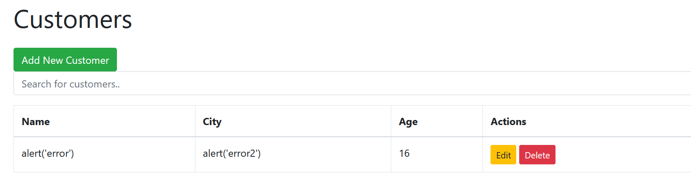
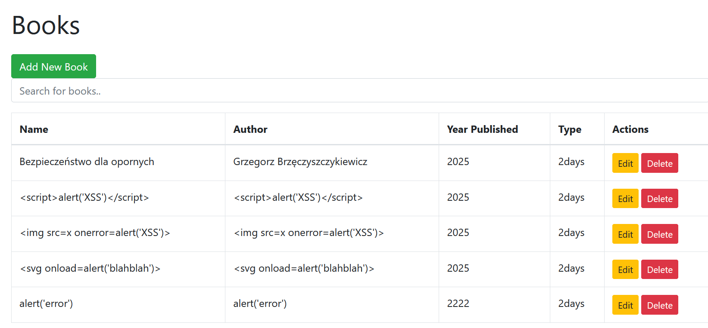

# Fix: Prevent XSS vulnerability in Books and Customers forms

## Typ podatności

**Cross-Site Scripting (XSS) Persistent (Stored XSS)**

## Lokalizacja podatności

### Backend
- `Python/Flask_Book_Library/project/books/views.py`
  - Funkcja `create_book()` - brak walidacji danych wejściowych
  - Funkcja `edit_book()` - brak walidacji danych wejściowych
- `Python/Flask_Book_Library/project/customers/views.py`
  - Funkcja `create_customer()` - brak walidacji danych wejściowych
  - Funkcja `edit_customer()` - brak walidacji danych wejściowych

### Frontend
- `Python/Flask_Book_Library/project/templates/books.html`
  - Linie 33-34: użycie filtra `| safe` wyłącza escapowanie HTML
- `Python/Flask_Book_Library/project/templates/customers.html`
  - Linie 33-34: użycie filtra `| safe` wyłącza escapowanie HTML


## Screenshoty udowadniające wystąpienie podatności

### 1. Wstrzyknięcie kodu XSS


*Screenshot pokazuje formularz z wstrzykniętym kodem `<script>alert('blahblah')</script>` w polu "Name".*

### 2. Rezultat - Alert JavaScript


*Screenshot pokazuje alert JavaScript wyświetlony po wstrzyknięciu kodu. Alert potwierdza, że kod JavaScript został zapisany w bazie danych i wykonany w przeglądarce użytkownika.*

### 3. Wstrzyknięte kody w tabeli


*Screenshot pokazuje listę książek, gdzie w kolumnie "Name" widoczny jest zapisany kod XSS. Kod został zapisany w bazie danych i jest wykonywany przy każdym wyświetleniu listy.*

## Rozwiązanie

### 1. Sanitizacja danych wejściowych w backendzie

Dodano bibliotekę `bleach` do `requirements.txt` i zaimplementowano sanitizację danych przed zapisem do bazy danych:

```python
from bleach import clean

# W funkcji create_book():
sanitized_name = clean(data['name'], tags=[], strip=True)
sanitized_author = clean(data['author'], tags=[], strip=True)
```

Funkcja `bleach.clean()` usuwa wszystkie tagi HTML i JavaScript z danych wejściowych, pozostawiając tylko bezpieczny tekst.

### 2. Usunięcie filtra `| safe` z szablonów

Usunięto filtr `| safe` z szablonów HTML, co pozwala Flask na automatyczne escapowanie HTML:

**Przed:**
```html
<td>{{ book.name | safe }}</td>
```

**Po:**
```html
<td>{{ book.name }}</td>
```

### 3. Podwójna ochrona

- **Poziom 1:** Sanitizacja na backendzie (usuwanie tagów HTML przed zapisem)
- **Poziom 2:** Automatyczne escapowanie HTML w szablonach (Flask domyślnie escapuje HTML)

## Zmienione pliki

1. `Python/Flask_Book_Library/requirements.txt` - dodano `bleach==6.1.0`
2. `Python/Flask_Book_Library/project/books/views.py` - dodano sanitizację w `create_book()` i `edit_book()`
3. `Python/Flask_Book_Library/project/customers/views.py` - dodano sanitizację w `create_customer()` i `edit_customer()`
4. `Python/Flask_Book_Library/project/templates/books.html` - usunięto filtr `| safe` z pól `name` i `author`
5. `Python/Flask_Book_Library/project/templates/customers.html` - usunięto filtr `| safe` z pól `name` i `city`

## Weryfikacja poprawki

Po wprowadzeniu poprawek:

### 1. Próba wstrzyknięcia kodu XSS


*Screenshot pokazuje próbę wstrzyknięcia kodu XSS po wprowadzeniu poprawek.*

### 2. Rezultat w tabeli Books


*Screenshot pokazuje, że kod XSS nie został wykonany - został wyświetlony jako zwykły tekst w tabeli Customers. Kod HTML został usunięty przez sanitizację i escapowanie.*

### 3. Rezultat w tabeli Customers


*Screenshot pokazuje, że kod XSS nie został wykonany - został wyświetlony jako zwykły tekst w tabeli Books (ostatnia pozycja). Podobnie jak w przypadku Customers, kod HTML został usunięty przez sanitizację i escapowanie.*

**Wnioski:**
- Kod XSS nie jest już wykonywany
- Kod jest wyświetlany jako zwykły tekst (bez tagów HTML)
- W bazie danych zapisuje się tylko czysty tekst (bez tagów HTML)


